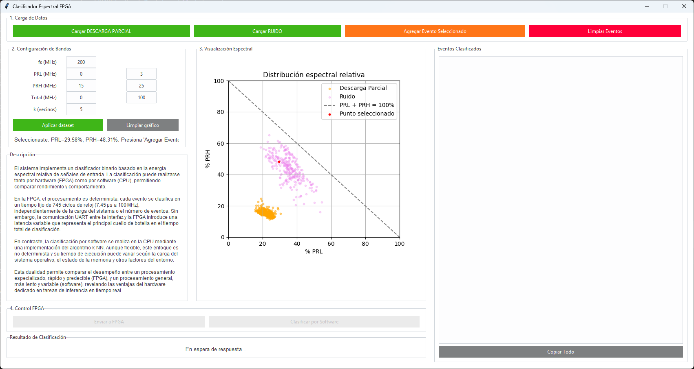

## Interfaz de Validación en Tiempo Real

  

La figura anterior muestra la interfaz gráfica desarrollada en Python mediante `tkinter` y `ttkbootstrap`, diseñada para facilitar la validación en tiempo real del clasificador binario implementado en FPGA.

Esta herramienta permite cargar archivos de eventos, configurar bandas espectrales y visualizar la distribución de datos PRL/PRH en el plano cartesiano. Cada evento puede ser clasificado tanto por software (utilizando k-NN en Python) como por hardware (vía FPGA), lo que permite comparar latencia, precisión y desempeño entre ambas plataformas.

Las funcionalidades principales incluyen:

- 📁 Carga de eventos para **descargas parciales** y **ruido**.  
- ⚙️ Configuración personalizada de bandas espectrales (PRL, PRH, Total).
- 📊 Visualización espectral relativa y marcado de eventos seleccionados.
- 📤 Envío de eventos a FPGA vía UART para su clasificación en hardware.
- 🧮 Clasificación alternativa por software para comparación directa.
- 🕒 Medición detallada de tiempos UART, tiempo interno en FPGA (en ciclos) y tiempo total de clasificación.

Cada evento puede ser inspeccionado individualmente, y los resultados se presentan en una lista con detalles de tiempo de procesamiento y clase asignada.

---

🔗 [Ver código fuente de la interfaz (interfaz.py)](interfaz.py)
